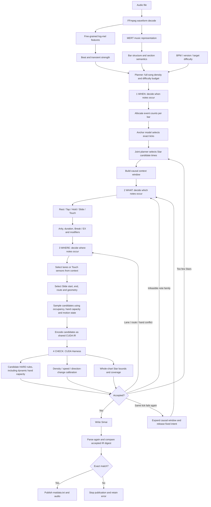

# maimai Chart Generator 0.4.0

English | [简体中文](README.md)

A native CUDA chart generator for maimai DX Simai charts. The current release uses a contextual V4 model for generation and one shared CUDA Harness for candidate and whole-chart checks. Only the bundled latest model set is supported; legacy checkpoints are incompatible.

## Features

- Generates BASIC through Re:MASTER charts from audio, BPM, game version, and target difficulty constants.
- Keeps Slide Stars and Tracks as separate representations and enforces explicit Star count bounds. The GUI Star target ratio directly means target Stars divided by the calibrated official-chart reference: 0 requests no Stars and 1 requests the reference count; it is no longer a first-draft gap-fill ratio.
- Returns HARD failures to a local context window; repeated failures at the same point expand the causal edit scope without regenerating the full song.
- Hand capacity is a native HARD rule. Before sampling, the runtime combines Hold, Slide, Tap, and Touch occupancy; when both hands are occupied, only a Touch covered by the active Slide hand may remain eligible.
- Writes `maidata.txt` only after a complete whole-chart permit and an identity-preserving Simai round trip.
- The Windows GUI entry point is `启动生成器.pyw`.

## Setup and launch

1. Install a CUDA-enabled PyTorch build and the Python dependencies: `pip install -r requirements.txt`.
2. Install FFmpeg separately and make sure `ffmpeg.exe` is available on PATH.
3. Double-click `启动生成器.pyw`.
4. Select the audio, version, difficulty constants, and BPM. Output is written to `generated` by default.

FFmpeg and MajdataViewX are not bundled. If MajdataViewX is installed at `tools/MajdataViewX-v6.2.0`, the Preview button will use it; otherwise the built-in chart preview is used. Built-in audio playback is available when `ffplay` is on PATH.

## How it works

Audio is decoded into log-mel features and represented by MERT. A structure model produces bar-level musical structure and difficulty density, while the anchor model combines BPM, structure, target difficulty, and game version to select candidate times. The contextual V4 renderer then generates note families, lanes, routes, durations, and modifiers causally while carrying previous-event, lane-occupancy, hand-capacity, slide-motion, and geometry state.

After anchoring, EXPERT, MASTER, and Re:MASTER use all `JointEventPlanModel` heads—`arity / stars / holds / touches / tap_slide`—to select WHAT jointly. Their output becomes a position-free `EventIntent`, and each difficulty is restricted to configurations observed in its own official-chart training split. V4 then chooses lanes, Touch sensors, Slide routes, durations, and modifiers. BASIC and ADVANCED currently retain combined V4 WHAT and WHERE generation.

The generator cannot declare its own chart valid. Every candidate is encoded into the shared CUDA IR and evaluated by the same Harness used for complete charts. HARD conflicts are rejected. Difficulties with calibration also receive short-window density, motion-speed, and direction-change checks. After whole-chart acceptance, the IR is serialized to Simai, parsed again, and required to retain the exact accepted content digest before publication.

## Architecture

Generator and Harness remain the only runtime responsibility owners, while Generator explicitly separates WHEN, WHAT, and WHERE decisions. Feedback does not restart the whole song: a Star deficit returns to WHEN, an infeasible family returns to WHAT, and lane, route, or hand conflicts return to WHERE first. Only a repeated failure at the same tick expands context and permits a new WHAT decision. Neural state and encoded audio before the edit window remain cached.

Candidate sampling consumes Harness snapshots before committing an event. Established HARD constraints become sampling masks. SOFT findings only rank alternatives, with CLEAN preferred when available. If every sampled realization is HARD, the generator emits a legal rest and later restores any Star deficit at another music anchor, avoiding a large repair window.

Main modules:

- `src/chart_runtime/generator`: planning, contextual V4 inference, structured sampling, caching, and local recovery.
- `src/chart_runtime/harness`: shared CUDA rules, candidate batching, quality features, feedback, and publication permits.
- `src/chart_runtime/io`: lossless event representation, Simai I/O, audio, and timing.
- `src/chart_runtime/runtime`: session contracts, immutable payloads, and CUDA resource management.
- `src/chart_runtime/app`: preparation, parallel difficulty generation, GUI, and preview entry points.

## Current boundaries

- NVIDIA CUDA is required; there is no CPU musical-judgement fallback.
- Generation is limited to the first 256 bars.
- Missing low-difficulty calibration is reported explicitly instead of being replaced by a synthetic threshold.
- Dynamic hand-capacity HARD uses Touch adjacency groups, Slide contact paths, and a 1/180-second release delay; the complete timeline is checked again before publication.
- Star timing prediction is currently stable, while route and placement quality remain areas for improvement.

## Licensing

Original project source code is licensed under the [Apache License 2.0](LICENSE). Bundled MERT model material is excluded from that grant and remains subject to [CC BY-NC 4.0](THIRD_PARTY_NOTICES.md), so distributions containing those weights are restricted to non-commercial use.

See the GitHub Wiki for architecture, operation, and troubleshooting details.
