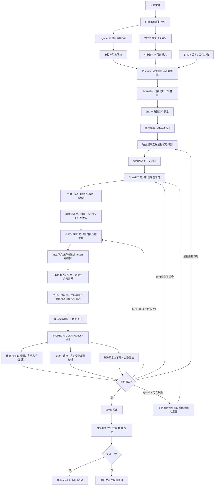

# maimai Chart Generator 0.4.0

[English](README.en.md) | 简体中文

面向 maimai DX Simai 谱面的原生 CUDA 生成器。当前版本使用 contextual V4 模型生成候选，并由同一套 CUDA Harness 检查候选与整谱。

## 功能

- 从音频、BPM、版本和目标定数生成 BASIC～Re:MASTER 谱面。
- 保留 Slide Star 与 Track 的独立表示，并控制星星数量上下限。GUI 的“星星目标比例”直接表示目标星星数相对校准官谱参考星星数的比例：0 为不要求星星，1 为官谱参考数；它不是从首个草稿向官谱数补差的比例。
- HARD 问题返回局部上下文重生成；相同阻塞点重复失败时扩大因果窗口，不重新生成整首。
- 手数限制是原生 HARD：候选生成前先计算 Hold、Slide、Tap 与 Touch 的占手状态；双手已满时，只允许落在当前 Slide 手掌覆盖区内的随滑 Touch。
- 只有完整整谱许可且 Simai 回读与许可稿一致时才写出 `maidata.txt`。
- Windows GUI 入口为 `启动生成器.pyw`。

## 环境与启动

1. 安装 NVIDIA CUDA 版 PyTorch 和 Python 依赖：`pip install -r requirements.txt`。
2. 自行安装 FFmpeg，并确保 `ffmpeg.exe` 位于系统 PATH。
3. 双击 `启动生成器.pyw`。
4. 选择音频、版本、定数和 BPM；结果默认保存到 `generated`。

MajdataViewX 和 FFmpeg 均不随仓库提供。若自行把 MajdataViewX 放到 `tools/MajdataViewX-v6.2.0`，预览按钮会优先调用它；否则使用内置谱面预览。系统存在 `ffplay` 时，内置预览可以同步播放音频。

## 实现原理

音频首先被解码为 log-mel 特征，并由 MERT 提取音乐表征。结构模型把整首音乐压缩为小节级结构与难度密度；锚点模型结合 BPM、歌曲结构、目标定数和版本选择候选时刻。contextual V4 renderer 按时间顺序生成音符类型、键位、轨迹、时值和修饰符，并维护前序事件、占用键位、手部容量、滑条运动及几何状态。

EXPERT、MASTER、Re:MASTER 在锚点之后由 `JointEventPlanModel` 的 `arity / stars / holds / touches / tap_slide` heads 联合选择 WHAT。输出被压缩为不含键位和路线的 `EventIntent`；各难度只能使用自身训练集官谱中实际出现过的配置。V4 根据该 intent 选择键位、Touch 传感器、Slide 路线、时值和修饰。BASIC、ADVANCED 当前仍由 V4 联合生成 WHAT 与 WHERE。

生成器不自行宣布谱面可用。每个候选都会编码为统一 CUDA IR，交给 Harness 使用与整谱相同的规则检查。HARD 冲突直接拒绝；具备校准的难度还会检查短时密度、运动速度和方向变化。整谱通过后，系统再把 IR 写为 Simai、重新解析，并要求内容摘要与获准草稿完全一致，之后才发布输出。

## 架构

运行时只有 Generator 与 Harness 两个职责主体，但 Generator 内部明确分成 WHEN、WHAT、WHERE 三层。Harness 反馈不会无条件从整首开头重来：星星数量不足返回 WHEN 增加候选时刻；类型不可行返回 WHAT；键位、轨迹或手部冲突优先返回 WHERE。同一 tick 再次失败时才扩大上下文并允许重新选择 WHAT。窗口之前的神经状态与音频编码继续复用。

候选采样会提前使用 Harness 快照：确定的 HARD 直接形成采样掩码；SOFT 仅参与候选排序，若存在 CLEAN 就优先使用 CLEAN。连续候选都违反 HARD 时选择合法空拍，星星配额随后在其他音乐锚点补足，从而减少整段返工。

主要模块：

- `src/chart_runtime/generator`：规划、contextual V4 推理、结构化采样、缓存和局部恢复。
- `src/chart_runtime/harness`：统一 CUDA 规则、候选批处理、质量特征、反馈与发布许可。
- `src/chart_runtime/io`：无损事件表示、Simai 解析/写出、音频和时间轴。
- `src/chart_runtime/runtime`：会话协议、不可变载荷和 CUDA 资源管理。
- `src/chart_runtime/app`：准备流程、并行难度生成、GUI 与预览入口。

## 已知边界

- 需要 NVIDIA CUDA，不提供 CPU 音乐判定回退。
- 音频最多生成前 256 小节。
- 低难度尚无同口径质量校准时会明确标记为不可用，而不是伪造阈值。
- 动态手数 HARD 使用 Touch 邻接组、Slide 接触路径和 1/180 秒松手延迟；整谱发布前会再次检查完整时间轴。
- 模型的星星时间预测已经较稳定，星星轨迹与落位仍有改进空间。

## 许可

本项目自研源码采用 [Apache License 2.0](LICENSE)。随仓库提供的 MERT 模型材料不属于 Apache-2.0 授权范围，继续受 [CC BY-NC 4.0](THIRD_PARTY_NOTICES.md) 约束，因此包含该权重的分发仅限非商业用途。

详细说明见 GitHub Wiki。
